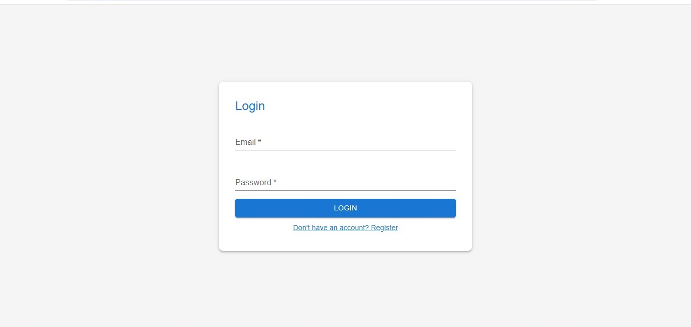
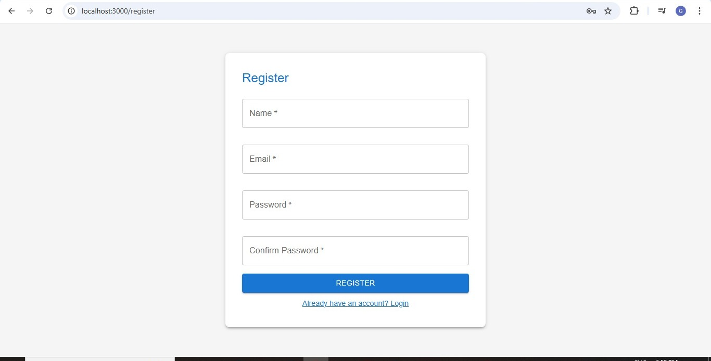
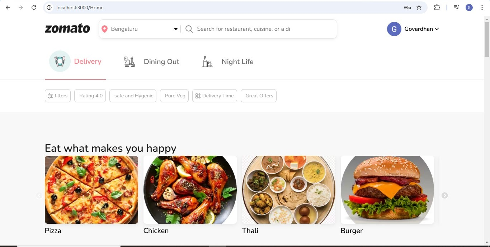
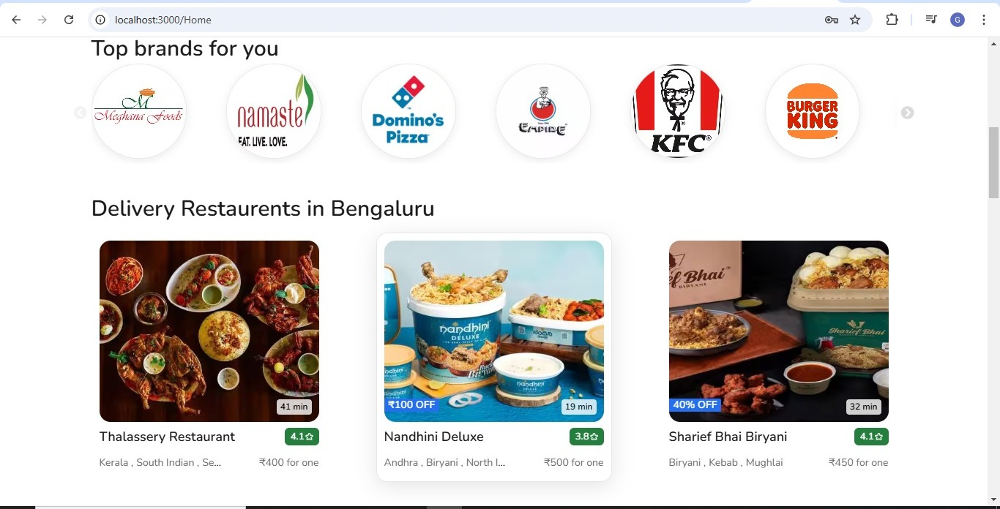
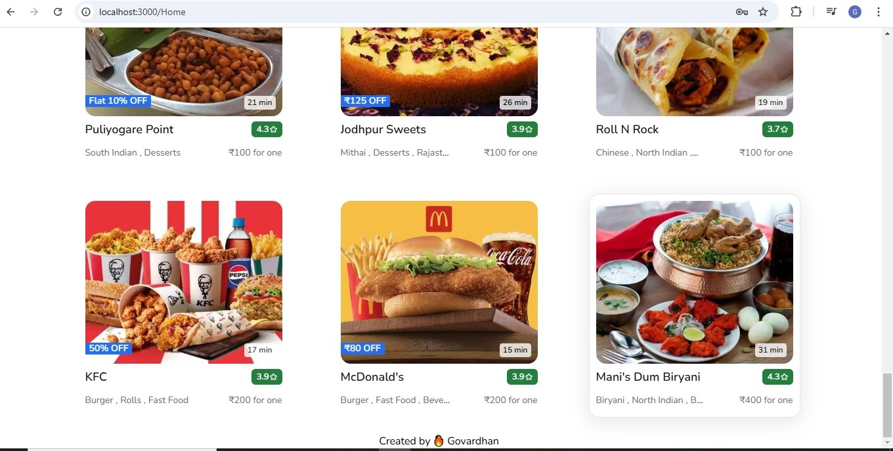
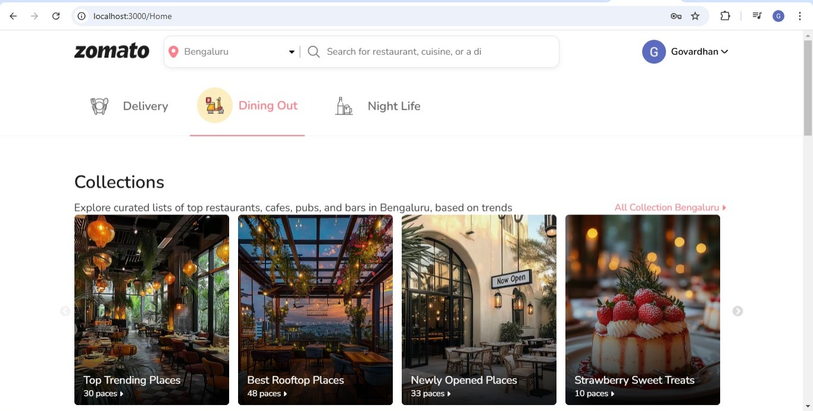
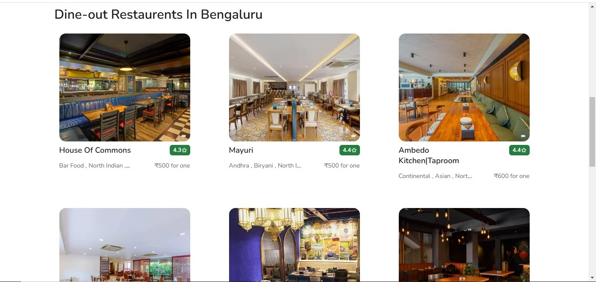

# Zomato Clone - UI Replica

## Overview

This project is a UI Clone of Zomato, designed to replicate the core features of the Zomato platform such as restaurant search, login functionality, and menu browsing. Built with React.js and Material UI, it focuses on user-friendly interactions, and clean interface. This is just a UI clone, so no backend integration is included.

## Features

### 1. Login Page with Validation
- Secure login feature with proper email and password validation.
- Uses Material UI components for the form design.
- Validation checks for correct email format and password strength.

### 2. Menu Display
- View the restaurant’s menu with a list of available dishes.
- Browse restaurant menus with dish name, price, and description.
- Option to see more details about the dish.

### 3. User-Friendly Interface

- Clean and modern design with Material UI components.
- Easy-to-navigate,for seamless user experience across devices

### 4. Restaurant Search Layout
- Search bar UI layout designed for restaurant search.
- Static design showing search results and filter options.

### 5.Routing for Navigation
- React Router used to navigate between pages like the login, menu, and dish details.
- Clear, intuitive page transitions for a seamless user experience.

### 6. Styled UI Elements
- Use of Material UI buttons, dropdowns, and forms.
- Visually appealing UI elements for a polished look and feel.

---

## Technology Stack

- Frontend Framework: React.js
- State Management: Redux
- Styling:Material UI

## How to Run

### 1. Prerequisites
- Node.js 
- npm 

### 2. Installation
1. Clone the repository:
  
   git clone https://github.com/Govardhanit1234/Zomato-UI-Clone.git

## Screenshots

### *1. Login and Register  Page*

### *2. Zomato UI Cone*

### Live Project Link
https://sunny-bonbon-2a1d75.netlify.app